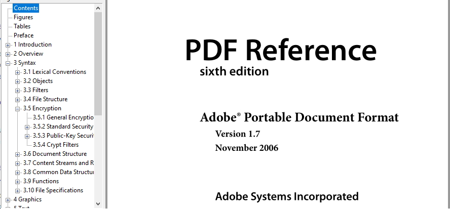

# Document Outline & Table of Contents

## Overview

This document explains how to implement and customize the Document Outline (also known as Bookmarks) and Table of Contents (ToC) features in `fpdf2`.

---

## Document Outline (Bookmarks)

Document outlines allow users to navigate quickly through sections in the PDF by creating a hierarchical structure of clickable links.

Quoting the 6th edition of the PDF format reference (v1.7 - 2006) :
> A PDF document may optionally display a **document outline** on the screen, allowing the user to navigate interactively
> from one part of the document to another. The outline consists of a tree-structured hierarchy of outline items
> (sometimes called bookmarks), which serve as a visual table of contents to display the document’s structure to the user.

For example, there is how a document outline looks like in [Sumatra PDF Reader](https://www.sumatrapdfreader.org/free-pdf-reader.html):



Since `fpdf2.3.3`, you can use the [`start_section`](fpdf/fpdf.html#fpdf.fpdf.FPDF.start_section) method to add entries in the internal "outline" table, which is used to render both the outline and ToC.

Note that by default, calling `start_section` only records the current position in the PDF and renders nothing.
However, you can configure **global title styles** by calling [`set_section_title_styles`](fpdf/fpdf.html#fpdf.fpdf.FPDF.set_section_title_styles), after which calls to `start_section` will render titles visually using the styles defined.

To provide a document outline to the PDF you generate, you just have to call the `start_section` method for every hierarchical section you want to define.

### Nested outlines

Outlines can be nested by specifying different levels. Higher-level outlines (e.g., level 0) appear at the top, while sub-levels (e.g., level 1, level 2) are indented.

```python
pdf.start_section(name="Chapter 1: Introduction", level=0)
pdf.start_section(name="Section 1.1: Background", level=1)
```

---

## Table of Contents

Quoting [Wikipedia](https://en.wikipedia.org/wiki/Table_of_contents), a **table of contents** is:
> a list, usually found on a page before the start of a written work, of its chapter or section titles or brief descriptions with their commencing page numbers.

### Inserting a Table of Contents

Use the [`insert_toc_placeholder`](fpdf/fpdf.html#fpdf.fpdf.FPDF.insert_toc_placeholder) method to define a placeholder for the ToC. A page break is triggered after inserting the ToC.

**Parameters:**
- **render_toc_function**: Function called to render the ToC, receiving two parameters: `pdf`, an FPDF instance, and `outline`, a list of `fpdf.outline.OutlineSection`.
- **pages**: The number of pages that the ToC will span, including the current one. A page break occurs for each page specified.
- **allow_extra_pages**: If `True`, allows unlimited additional pages to be added to the ToC as needed. These extra ToC pages are initially created at the end of the document and then reordered when the final PDF is produced.

**Note**: Enabling `allow_extra_pages` may affect page numbering for headers or footers. Since extra ToC pages are added after the document content, they might cause page numbers to appear out of sequence. To maintain consistent numbering, use (Page Labels)[PageLabels.md] to assign a specific numbering style to the ToC pages. When using Page Labels, any extra ToC pages will follow the numbering style of the first ToC page.

### Reference Implementation

_New in [:octicons-tag-24: 2.8.2](https://github.com/py-pdf/fpdf2/blob/master/CHANGELOG.md)_

The `fpdf.outline.TableOfContents` class provides a reference implementation of the ToC, which can be used as-is or subclassed.

```python
from fpdf import FPDF
from fpdf.outline import TableOfContents

pdf = FPDF()
pdf.add_page()
toc = TableOfContents()
pdf.insert_toc_placeholder(toc.render_toc, allow_extra_pages=True)
```

---

## Using Outlines and ToC with HTML

When using [`FPDF.write_html`](HTML.md), a document outline is automatically generated, and a ToC can be added with the `<toc>` tag.

To customize ToC styling, override the `render_toc` method in a subclass:

```python
from fpdf import FPDF, HTML2FPDF

class CustomHTML2FPDF(HTML2FPDF):
    def render_toc(self, pdf, outline):
        pdf.cell(text='Table of contents:', new_x="LMARGIN", new_y="NEXT")
        for section in outline:
            pdf.cell(text=f'* {section.name} (page {section.page_number})', new_x="LMARGIN", new_y="NEXT")

class PDF(FPDF):
    HTML2FPDF_CLASS = CustomHTML2FPDF

pdf = PDF()
pdf.add_page()
pdf.write_html("""<toc></toc>
    <h1>Level 1</h1>
    <h2>Level 2</h2>
    <h3>Level 3</h3>
    <h4>Level 4</h4>
    <h5>Level 5</h5>
    <h6>Level 6</h6>
    <p>paragraph<p>""")
pdf.output("html_toc.pdf")
```

---

## Additional Code Samples

The regression tests are a good place to find code samples.

For example, the [`test_simple_outline`](https://github.com/py-pdf/fpdf2/blob/master/test/outline/test_outline.py) test function generates the PDF document [simple_outline.pdf](https://github.com/py-pdf/fpdf2/blob/master/test/outline/simple_outline.pdf).

Similarly, [`test_html_toc`](https://github.com/py-pdf/fpdf2/blob/master/test/outline/test_outline_html.py)
generates [test_html_toc.pdf](https://github.com/py-pdf/fpdf2/blob/5453422bf560a909229c82e53eb516e44fea1817/test/outline/test_html_toc.pdf).

---

## Manually Adjusting `pdf.page`
Setting `pdf.page` manually may result in unexpected behavior. `pdf.add_page()` takes special care to ensure the page's content stream matches fpdf's instance attributes. Manually setting the page does not.
