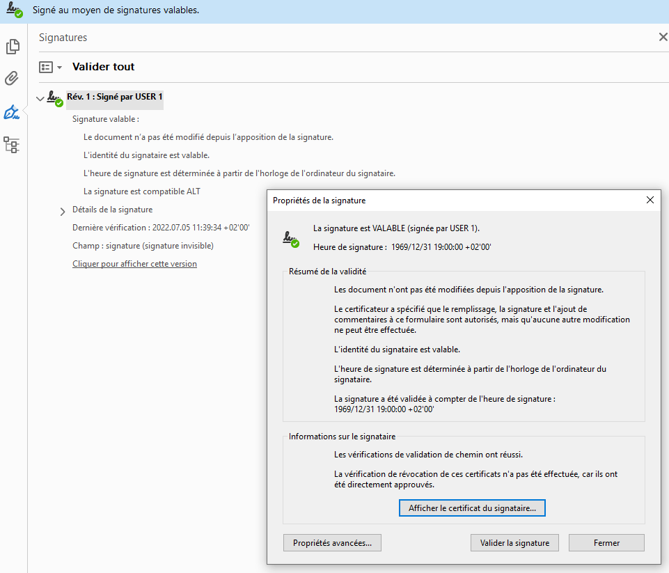

# Signing #

> A digital signature may be used to authenticate the identity of a user and the document’s contents.
> It stores information about the signer and the state of the document when it was signed.

`fpdf2` allows to **sign** documents using [PKCS#12](https://en.wikipedia.org/wiki/PKCS_12) certificates ([RFC 7292](https://datatracker.ietf.org/doc/html/rfc7292)).

The [endesive](https://pypi.org/project/endesive/) package is **required** to do so.

```python
pdf = FPDF()
pdf.add_page()
pdf.sign_pkcs12("certs.p12", password=b"1234")
pdf.output("signed_doc.pdf")
```



The lower-level [sign()](https://pyfpdf.github.io/fpdf2/fpdf/fpdf.html#fpdf.fpdf.FPDF.sign) method
allows to add a signature based on arbitrary key & certificates, not necessarily from a PKCS#12 file.

`endesive` also provides basic code to check PDFs signatures.
[examples/pdf-verify.py](https://github.com/m32/endesive/blob/master/examples/pdf-verify.py)
or the [`check_signature()`](https://github.com/PyFPDF/fpdf2/blob/master/test/conftest.py#L111) function
used in `fpdf2` unit tests can be good starting points for you, if you want to perform PDF signature control.
