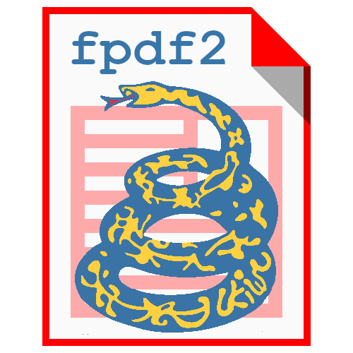
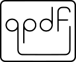
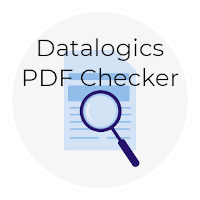

# fpdf2 #

`fpdf2` is a library for PDF document generation in Python, forked from the unmaintained [pyfpdf](https://github.com/reingart/pyfpdf), itself ported from the PHP [FPDF](http://www.fpdf.org/) library.

**Latest Released Version:** 

## Main features ##

* Easy to use (and easy to extend)
* Small and compact code, useful for testing new features and teaching
* Many simple examples and scripts available in many languages
* PIL Integration for images (via Pillow)
* No installation, no compilation or other libraries (DLLs) required

This repository is a fork of the library's [original port by Max Pat](http://www.fpdf.org/dl.php?id=94), with the following enhancements:

* Python 3.6+ support
* [Unicode](Unicode.md) (UTF-8) TrueType font subset embedding (Central European, Cyrillic, Greek, Baltic, Thai, Chinese, Japanese, Korean, Hindi and almost any other language in the world)
* PNG, GIF and JPG support (including transparency and alpha channel)
* Shape, Line Drawing
* Arbitrary path drawing and basic SVG import
* Generate [Code 39](https://fr.wikipedia.org/wiki/Code_39) & [Interleaved 2 of 5](https://en.wikipedia.org/wiki/Interleaved_2_of_5) barcodes
* Cell / multi-cell / plaintext writing, automatic page breaks
* Basic conversion from HTML to PDF
* Images & links alternative descriptions
* Table of contents & [document outline](https://pyfpdf.github.io/fpdf2/DocumentOutlineAndTableOfContents.html)
* Optional basic Markdown-like styling: `**bold**, __italics__, --underlined--`
* Clean error handling through exceptions
* Only **one** dependency so far: [Pillow](https://pillow.readthedocs.io/en/stable/)
* Unit tests with `qpdf`-based PDF diffing
* PDF samples validation using 3 different checkers:

FPDF original features:

* Choice of measurement unit, page format and margins
* Page header and footer management
* Automatic page break, line break and text justification
* Image, colors and links support
* Page compression

## Tutorials ##

* [English](https://pyfpdf.github.io/fpdf2/Tutorial.html)
* [Deutsch](https://pyfpdf.github.io/fpdf2/Tutorial-de.html)
* [Italian](https://pyfpdf.github.io/fpdf2/Tutorial-it.html)
* [español](https://pyfpdf.github.io/fpdf2/Tutorial-es.html)
* [français](https://pyfpdf.github.io/fpdf2/Tutorial-fr.html)
* [हिंदी](https://pyfpdf.github.io/fpdf2/Tutorial-हिंदी.html)
* [português](https://pyfpdf.github.io/fpdf2/Tutorial-pt.html)
* [Русский](https://pyfpdf.github.io/fpdf2/Tutorial-ru.html)

## Installation ##

* From [PyPI](https://pypi.python.org/pypi/fpdf2): `pip install fpdf2`
* From source:
    * Clone the repository: `git clone https://github.com/PyFPDF/fpdf2.git`
    * On ubuntu the following packages are required: `sudo apt-get install libjpeg-dev libpython-dev zlib1g-dev`
    * Run `python setup.py install`

**Developement**: check the [dedicated documentation page](Development.md).

## Community ##

### Support ###

For community support, please feel free to file an [issue](https://github.com/PyFPDF/fpdf2/issues)
or [open a discussion](https://github.com/PyFPDF/fpdf2/discussions).

### They use fpdf2 ###
<!-- cf. Watchman Pypi & DavHau/pypi-deps-db -->
* [Undying Dusk](https://lucas-c.itch.io/undying-dusk) : a **video game in PDF format**, with a gameplay based on exploration and logic puzzles, in the tradition of dungeon crawlers
* [OpenDroneMap](https://github.com/OpenDroneMap/ODM) : a command line toolkit for processing aerial drone imagery
* [OpenSfM](https://github.com/mapillary/OpenSfM) : a Structure from Motion library, serving as a processing pipeline for reconstructing camera poses and 3D scenes from multiple images
* [RPA Framework](https://github.com/robocorp/rpaframework) : libraries and tools for Robotic Process Automation (RPA), designed to be used with both [Robot Framework](https://robotframework.org)
* [Concordia](https://github.com/LibraryOfCongress/concordia) : a platform developed by the US Library of Congress for crowdsourcing transcription and tagging of text in digitized images
* [GovReady-Q Compliance Server](https://github.com/GovReady/govready-q) : GRC platform for highly automated, user-friendly, self-service compliance assessments and documentation (DevSecOps)
* [csv2pdf](https://github.com/TECH-SAVVY-GUY/csv2pdf) : convert CSV files to PDF files easily

### Related ###

* [Create PDFs with Python](https://www.youtube.com/playlist?list=PLjNQtX45f0dR9K2sMJ5ad9wVjqslNBIC0) : a series of tutorial videos by bvalgard
* [digidigital/Extensions-and-Scripts-for-pyFPDF-fpdf2](https://github.com/digidigital/Extensions-and-Scripts-for-pyFPDF-fpdf2) : scripts ported from PHP to add transpareny to elements of the page or part of an image, allow to write circular text,
   draw pie charts and bar diagrams, embed JavaScript, draw rectangles with rounded corners, draw a star shape,
   restrict the rendering of some elements to screen or printout, paint linear / radial / multi-color gradients gradients, add stamps & watermarks, write sheared text...
* Looking for alternative libraries? Check out [this detailed list of PDF-related Python libs by Patrick Maupin (`pdfrw` author)](https://github.com/pmaupin/pdfrw#other-libraries).
  There is also [borb](https://github.com/jorisschellekens/borb), [pikepdf](https://github.com/pikepdf/pikepdf) & [WeasyPrint](https://github.com/Kozea/WeasyPrint).
  More about combining `fpdf2` with `borb` & `pdfrw` [on this page](ExistingPDFs.md).

## Misc ##

* Release notes: [CHANGELOG.md](https://github.com/PyFPDF/fpdf2/blob/master/CHANGELOG.md)
* This library could only exist thanks to the dedication of many volunteers around the world:
  [list & map of contributors](https://github.com/PyFPDF/fpdf2/blob/master/README.md#contributors-)
* You can download an offline PDF version of this manual: [fpdf2-manual.pdf](fpdf2-manual.pdf)
